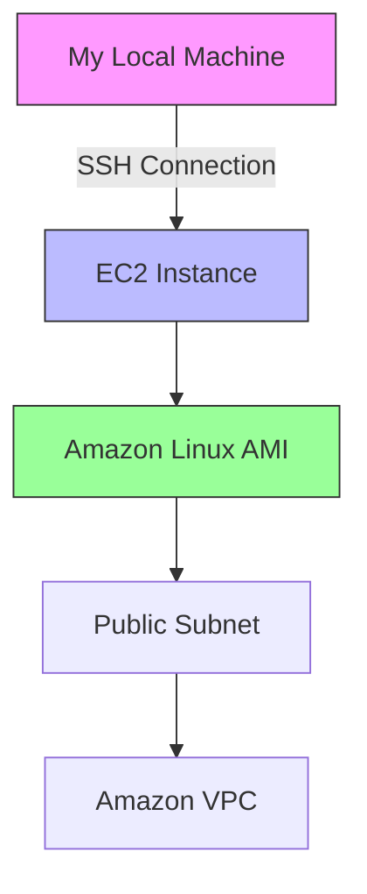

# AWS Lab 1: Introduction to Amazon Linux AMI via SSH

This lab reinforced my knowledge of basic command line interface functionality and provided a foundation for learning more Linux commands and capabilities.

## Lab Objectives

- Use SSH to access an Amazon Linux AMI within Vocareum labs
- Understand the purpose of the `man` command
- Demonstrate the search feature of the man pages
- Examine man page headers

## Lab Architecture



## Step-by-Step Implementation

### Task 1: Connect to Amazon Linux EC2 Instance using SSH

#### For Windows Users (using PuTTY):

1. **Downloaded the PPK file** from Vocareum lab credentials
2. **Launched PuTTY** and configured the session:
   - Host Name: `35.88.108.185` (public IP)
   - Connection type: SSH
   - Loaded the private key (`labsuser.ppk`) under SSH > Auth > Credentials


3. **Connected to the instance** and authenticated using the private key


4. **Verified the Amazon Linux version** (noted that Amazon Linux 2023 is available)

#### For Mac/Linux Users:
(Would use native SSH with command: `ssh -i key.pem ec2-user@public-ip`)

### Task 2: Explore Linux Manual Pages

1. **Accessed the manual pages** for the `man` program itself:
   ```bash
   man man
   ```

2. **Examined the man page structure** including:
   - NAME: Brief description
   - SYNOPSIS: Command usage
   - DESCRIPTION: Detailed explanation
   - OPTIONS: Available flags
   - SEE ALSO: Related commands


3. **Navigated through the pages** using arrow keys
4. **Exited the man pages** by pressing `q`

## Key Learnings

1. **SSH Configuration**: Learned to set up SSH connections to EC2 instances using PuTTY
2. **Amazon Linux AMI**: Gained familiarity with the Amazon Linux environment
3. **Manual Pages**: Understood how to access and navigate Linux documentation
4. **Command Line Basics**: Reinforced fundamental CLI skills

## Next Steps

1. Explore more Linux commands and their man pages
2. Practice creating and managing EC2 instances
3. Learn about Amazon Linux 2023 (the newer version mentioned)
4. Experiment with other SSH clients and configurations
